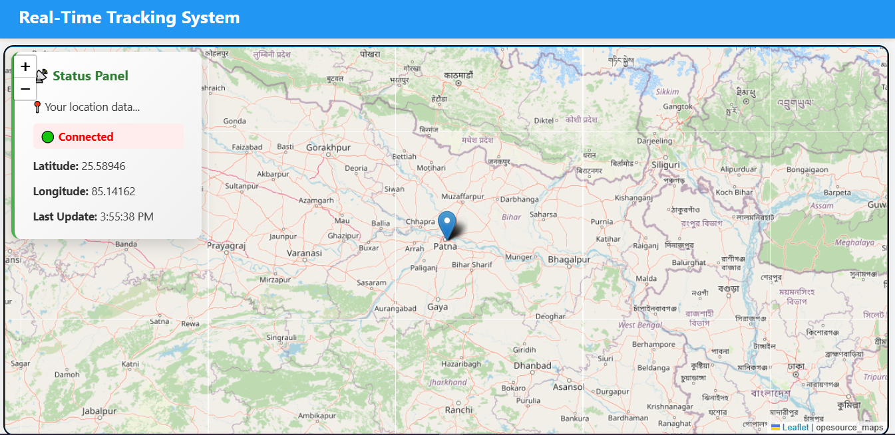

# 🌍 Real-Time GPS Tracking System

A real-time location tracking web app using **Node.js**, **Socket.IO**, and **Leaflet.js**. This system displays live latitude and longitude data on an interactive map with a status panel that updates in real-time.

---

live demo : https://real-time-tracking-system-liep.onrender.com/


## 📸 Preview



---

## 🚀 Features

### 🔴 Real-Time Location Updates
- Streams live latitude and longitude using Socket.IO.
- Updates position on the map instantly.

### 🗺️ Leaflet.js Interactive Map
- Uses OpenStreetMap with Leaflet for lightweight and responsive mapping.
- Displays a draggable and zoomable marker.

### 📡 Status Panel
- Shows:
  - ✅ Connection status
  - 📍 Current Latitude & Longitude
  - 🕒 Last update time
- Styled with clear icons and colors for better UX.

### ⚡ WebSocket (Socket.IO)
- Low-latency two-way data flow.
- Auto-reconnects if connection drops.

### 📱 Device Friendly
- Can work with browser’s Geolocation API.
- Ideal for mobile or GPS-enabled devices.

### 📦 Future Enhancements
🔐 Authentication (user-specific tracking)
🗂️ Location history & path tracing
🛰️ Integration with real GPS devices or trackers
📱 Mobile app interface

### 🧑‍💻 Author
Made with ❤️ by Nitin
---

## 🛠️ Installation & Usage

### 🔧 Requirements
- Node.js (v14+ recommended)
- Internet access (for OpenStreetMap & CDN)

### 📦 Setup Steps

1. **Clone the repository:**

   ```bash
   git clone https://github.com/nitin864/real-time-gps-tracker.git
   cd real-time-gps-tracker
2. Install dependencies:

   ```bash
   npm install
3. Start the server:

   ```bash
   npx nodemon app.js

4. Open in browser:

   Navigate to: http://localhost:3000
      
 
